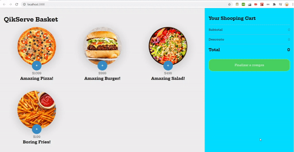

# Qikserve Basket

<p align="center">
  
</p>

# Technologies
      
  - Nodejs 12.16.2
  - Java 1.8 for wiremock (you can change this API if you want)

It is necessary to use the API that contains the images used in the front end

# Clone this project
```bash 

 #clone the project 
 git clone https://github.com/it4lo/qikserve.git

 ```    

# How to run wiremock

```bash 
 
 cd wiremock
 
 java -jar wiremock-standalone-2.14.0.jar
 
 ```
 
# How to run front-end

```bash 
 
 cd shopping-basket
  
  #install dependencies
  yarn
  
  #run the project
  yarn start
 
 ``` 

# Author

Italo Almeida

https://www.linkedin.com/in/%C3%ADtalo-almeida-51218188/

